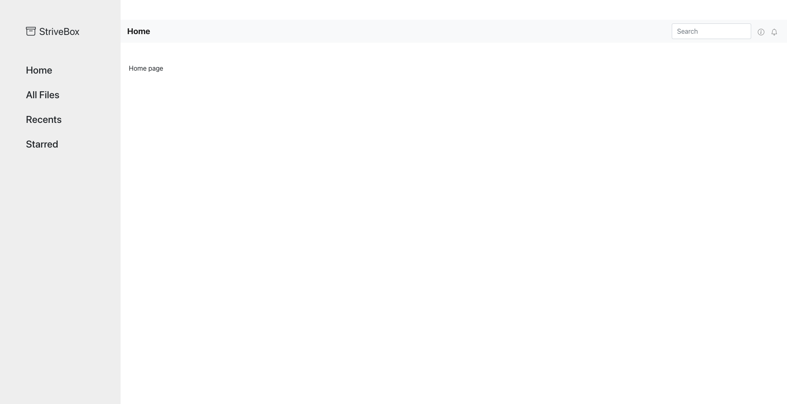

# StriveBox

Simple dropbox like layout for demonstrating file-upload download from frontend.


## 📦 Install Dependencies

Just run it, will install following dependencies for you.

- react-bootstrap
- bootstrap
- react-router-dom

```

    npm i && npm start

```

If you followed all these 👆 instructions , you are good to go. 🚀

🧑‍💻 We are going to start creating frontend together.
